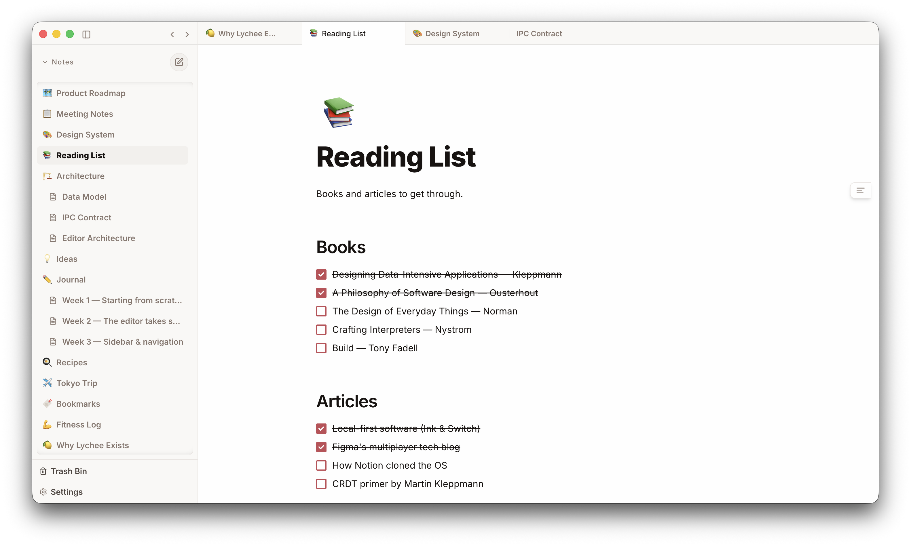

<br>

<p align="center">
  
</p>

<h1 align="center">Lychee</h1>

<p align="center">
  <strong>A fast, local-first notes app for people who just want to write.</strong>
</p>

<p align="center">
  
  
  
  
  
</p>

<br>

<p align="center">
  <em>Notion circa 2019 — before the enterprise bloat and the feature creep.<br>Just a clean, fast place to write.</em>
</p>

<br>

<p align="center">
  
</p>

<br>

---

<br>

### Features

| | |
|---|---|
| **Block editor** | Notion-style rich text powered by [Lexical](https://lexical.dev) |
| **Slash commands** | Type `/` to insert any block type |
| **Drag & drop** | Grab the handle to reorder any block |
| **Images** | Paste or drop images with resize + alignment controls |
| **Nested pages** | Organize notes up to 5 levels deep |
| **Tabs** | Open multiple notes side by side |
| **Emoji icons** | Give each note a custom icon |
| **Trash & restore** | Soft-delete with easy recovery |
| **Keyboard-first** | Full shortcut support for formatting + navigation |
| **100% local** | SQLite on your machine. No cloud. No account. |

<br>

### Quick start

```bash
npx degit reddpy/lychee lychee
cd lychee
npm install   # or pnpm, yarn — whatever you prefer
npm start
```

<br>

### Project structure

```
src/
├── main/           Electron main process, SQLite, IPC
├── renderer/       App shell, Zustand store, tabs
├── components/
│   ├── editor/     Block editor (nodes, plugins, themes)
│   ├── sidebar/    Note tree, emoji picker, trash
│   └── ui/         Shared primitives (Radix)
├── shared/         Types shared across processes
└── preload.ts      Bridge — window.lychee.invoke / on
```

<br>

### Tech

Electron &middot; React &middot; Lexical &middot; TypeScript &middot; Zustand &middot; SQLite &middot; Tailwind CSS

<br>

### License

[MIT](LICENSE)

<br>

<p align="center">
  
</p>
